# コンテナを身体で覚える - Day1: ハンズオン

1. 関連リソースの構築
2. Web アプリケーションの動作確認 (Cloud9)
3. Docker イメージの作成
4. Docker イメージを ECR に登録
5. AWS 上のコンテナ実行環境
6. ECS クラスターの作成
7. タスク定義の作成
8. サービスの作成
9. Web アプリケーションの動作確認 (Fargate)
10. Web アプリケーションの修正

## はじめに
ハンズオンでは Amazon ECS（以下、ECS）を使って、コンテナ用のサーバーレスコンピューティング環境である AWS Fargate 上に Web アプリケーション、`Boyacky`(ボヤッキー) をデプロイします。

以下は全体のシステム構成図です。


Boyacky は Silverworks が作成した、疲れたおじさんをターゲットにした SNS アプリケーションです。
間もなくサービスインを予定しています。

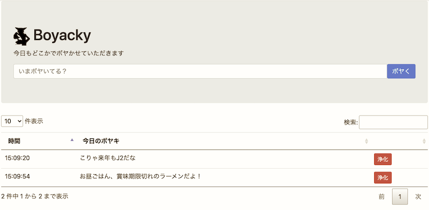

* 主な機能
   * ボヤく
       * ボヤくと心が一瞬だけ軽くなる
   * 一覧表示
       * 本日のボヤキが表示される (前日以前は表示されない)
       * 見ると心が重くなる
   * 浄化
       * 押すとボヤキが消え、心がすっと軽くなる

> ぼやきというのは、理想と現実とのギャップがあるから生まれるんですよ。  
> ただ、現状を嘆いているだけの愚痴とは違うんです。  
> 人生はままならないものだが、理想へ向けて努力することを忘れてはならない。だからぼやくのです。 
>  
> 野村克也元監督

## 1. 関連リソースの構築
ECS は VPC 環境下で利用するサービスです。

ECS 上でサービスを動かすためには、多くの関連リソースを構築する必要があります。
インターネットからアクセスする Web アプリケーションの場合、ECS/ECR を構築する前に以下の関連リソースが必要になります。

* VPC
* サブネット
    * Public と Private をそれぞれ2つずつ
* Internet Gateway
* ルートテーブル
    * Public サブネットのデフォルトルートを IGW に設定
* セキュリティグループ
    * ALB 用
    * Web アプリケーション用
* Load Balancer
    * ALB
    * ターゲットグループ
* CloudWatch Log Group
    * コンテナのログ出力先
* IAM ロール
* ECS / ECR コントロールプレーンとの通信
    * NAT ゲートウェイ or PrivateLink ( Private サブネットにデプロイする場合)

### 1.1 CloudFormation スタックの作成
今回は時間の都合上、CloudFormation（以下、CF）を利用して関連リソースの構築を自動で行います。構築する AWS リソースは下図になります。

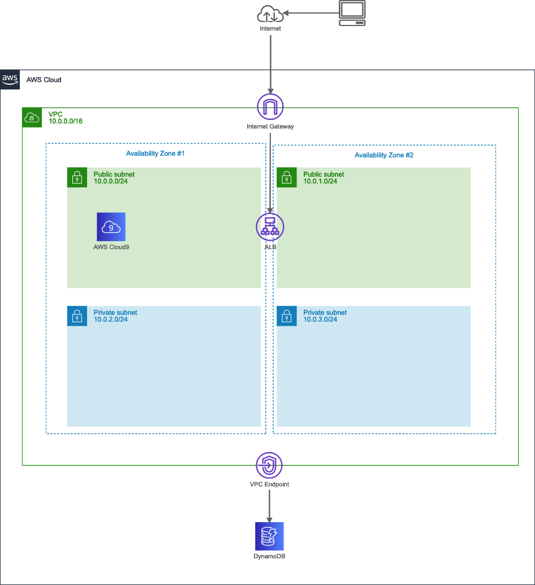

ハンズオンは東京リージョン (ap-northeast-1) で進めますが、別リージョンでも構いません。その場合は適宜読み替えてください。

1. CF テンプレート [boyacky.yam](https://github.com/hassaku63/boyacky/blob/master/handson/boyacky.yaml) のダウンロード
2. [CloudFormation コンソール](https://ap-northeast-1.console.aws.amazon.com/cloudformation)から CF テンプレートファイルのアップロード
    * スタック名: `BoyackyStack`

* 【課題】
    * CF テンプレートの中身を確認してください。
    * スタックが2つ作成されているのを確認してください。
    * 作成されたリソースを確認してください。
        * 後で利用するため、作成した`VPC ID`をメモします。

### 1.2 Cloud9環境の起動
ハンズオンでは作業環境を統一するため Cloud9 を利用します。
[Cloud9 コンソール](https://ap-northeast-1.console.aws.amazon.com/cloud9/home)から `ECS Handson` 環境を選択して、[Open IDE] ボタンを押下します。

下図は Cloud9 を利用して SSH 経由で EC2 環境に接続するイメージです。

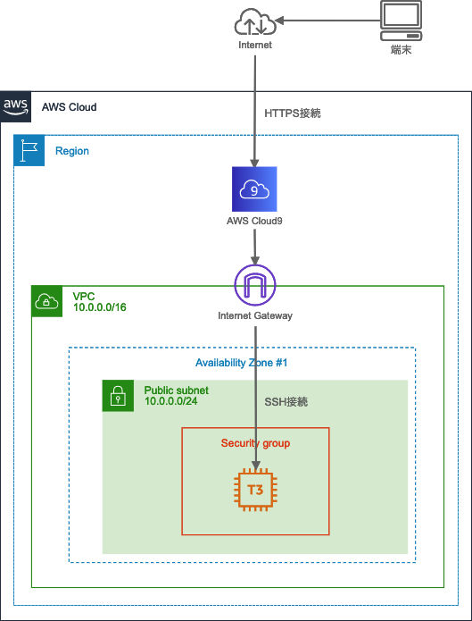

しばらくすると Cloud9 の画面が表示されます。

* 【課題】
    * Cloud9 ではよく使われる CLI がプリインストールされています。ターミナルで下記コマンドを実行してみてください。
        * git --version
        * docker --version
        * aws --version
    * EC2 のセキュリティグループ、インバウンドルールを確認してください。
        * Cloud9 画面の右上、You アイコン(丸形)を押下して [Manage EC2 Instance] から EC2 コンソール画面を表示できます。

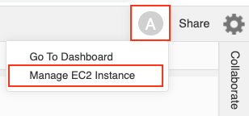

## 2. Web アプリケーションの動作確認 (Cloud9)
まずは Cloud9 上で Boyacky の動作確認を行い正しく動くことを確認します。  

### 2.1 コードのダウンロード
[ハッサク](https://github.com/hassaku63/boyacky)の GitHub からコードをダウンロードします。

```
$ git clone git@github.com:hassaku63/boyacky.git
```

### 2.2 モジュールのインストール
必要なパッケージをユーザーディレクトリにインストールします。

```
$ cd boyacky
$ pip install --user -r requirements.txt
```

### 2.3 Web アプリケーションのローカル実行
Boyacky を実行します。

```
$ python app.py
 * Serving Flask app "app" (lazy loading)
 * Environment: production
   WARNING: This is a development server. Do not use it in a production deployment.
   Use a production WSGI server instead.
 * Debug mode: off
 * Running on http://0.0.0.0:8080/ (Press CTRL+C to quit)
```

Cloud9 ツールバーの [Preview]-[Preview Running Application] を選択して内部ブラウザを表示します。

いくつかデータを登録して動きを確認してください。

> 内部ブラウザのため、Post した後に画面がリフレッシュされません。
> Post 後に内部ブラウザ左上のリロードボタンを押してリフレッシュしてください。

Web アプリケーションを終了する場合、ターミナル上で [CTRL]+[C] キーを押します。

* 【課題】
    * app.py と boyaki.py のソースコードを開いてロジックを確認してください。
    * templates フォルダ内の html を開いてレイアウトを確認してください。
    * [DynamoDB コンソール](https://ap-northeast-1.console.aws.amazon.com/dynamodb)で追加したデータを確認してください。


## 3. Docker イメージの作成
Boyacky 用の Docker イメージ（以下、イメージ）を作成します。
作成したイメージを Cloud9 上でコンテナ実行して Docker コマンドやライフサイクルを確認します。

最初に Docker アーキテクチャを整理します。

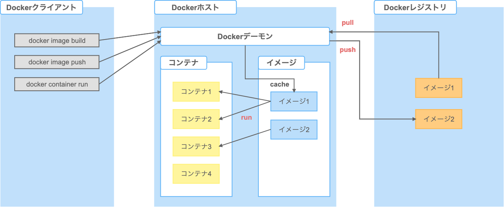

Docker はクライアント・サーバ型のアーキテクチャです。

Docker クライアントは Docker デーモンと通信することでコンテナを構築しアプリケーションを実行します。

Docker クライアントと Docker デーモンは同一ホストでも動作しますが、ソケットや RESTful API を通して別々のホストで動かすこともできます。

Cloud9 では Docker クライアントとデーモンがインストールされており、デーモンは起動した状態です。

| コンポーネント | 説明 |
|----|----|
| イメージ | Docker コンテナを構成するファイルシステムやメタ情報の集合体。<br>イメージは iso ファイルのように1ファイルで構成されているわけではなく、親子関係を持つ複数のレイヤーによって構成されています。 |
| コンテナ | イメージを元に作成される仮想環境の実行部分。イメージとコンテナは 1:N の関係です。 |
| レジストリ | イメージをホスティング、バージョン管理、配布するリポジトリ。<br>Docker レジストリは、Public/Private に対応した[Docker Hub](https://hub.docker.com)やPrivate用の[Amazon ECR](https://aws.amazon.com/ecr)などがあります。 |

コンポーネント間の関係とライフサイクルも抑えておきます。

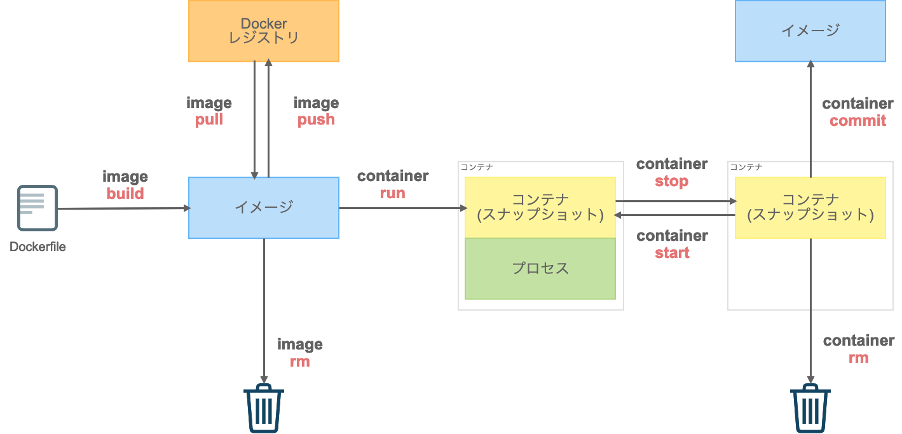

Dockerfile は、Docker 上で動作させるコンテナの構成情報を記述するためのテキストファイルでイメージの元になります。

* 開発
    1. Dockerfile を作成する
    2. `image build`コマンドでローカルにイメージを作成する
    3. `tag` コマンドでイメージにタグを付与する
    4. `image push`コマンドで Docker レジストリにイメージを保管する
* 運用
    1. `container run`コマンドでイメージを取得してコンテナを起動する
* 破棄
    1. `container stop`コマンドでコンテナを停止する
    2. `container rm`コマンドでコンテナを削除する

#### Docker コマンド
コマンドの数が増えたことにより、2017年にDockerコマンドの命令体系が再編成されました。
現在では、サブコマンド(image, container)を利用した新コマンドが推奨されています。

例えば、イメージの一覧表示とコンテナの一覧表示はそれぞれ

* docker images
* docker ps

でしたが、新コマンドでは

* docker image ls
* docker container ls

になります。

イメージ管理用コマンド

| 新コマンド | 旧コマンド | 説明 |
|----|----|----|
| build | | Dockerfile からイメージを構築 |
| history | | イメージの履歴を表示 |
| import | | tar形式のファイルを読み込み、イメージを作成 |
| inspect | | イメージの詳細情報を表示 |
| load | | tar形式または標準入力からイメージを読み込む |
| ls	| images | イメージの一覧表示 |
| prune | - | 使用していないイメージを削除 |
| pull | | イメージをレジストリから取得 |
| push | | イメージをレジストリに送信 |
| rm | rmi | イメージを削除 |
| save | | イメージを tar 形式または標準出力にストリーム |
| tag | | イメージを参照する新しいタグを付ける ([参考](https://docs.docker.jp/linux/step_six.html)) |

コンテナ管理用コマンド

| 新コマンド | 旧コマンド | 説明 |
|----|----|----|
| attach	| | 実行中のコンテナにアタッチ |
| commit	| | コンテナに対する変更から新しいイメージを作成 |
| cp	| | コンテナとローカル間でファイルとディレクトリのコピー |
| create | | 新しいコンテナの作成 |
| diff | | イメージとコンテナの変更情報を調べる |
| exec | | 実行中のコンテナ内でコマンド実行 |
| export | | コンテナのファイルシステムをtarアーカイブ化 |
| inspect | | コンテナの詳細情報を表示 |
| kill | | コンテナのプロセスを停止(kill) |
| logs | | コンテナのログを表示 |
| ls | ps | コンテナ一覧の表示 |
| pause | | コンテナのプロセスを一時停止(pause) |
| port | | コンテナが使用しているポート情報の表示 |
| prune | - | 停止中の全コンテナを削除 |
| rename | | コンテナの名称を変更 |
| restart | | コンテナを再起動 |
| rm	| | コンテナの削除 |
| run | | 新しいコンテナを実行 |
| start | | 停止中のコンテナを起動 |
| stats | | コンテナのリソース使用状況を表示 |
| stop | | 実行中のコンテナを停止 |
| top | | コンテナが実行しているプロセスを表示 |
| unpause | | 一時停止中のコンテナを再開 |
| update | | コンテナの（リソース）設定を変更 |
| wait | | コンテナが停止するまで待機 |

* 【課題】
    * `service`コマンドで docker デーモンのステータスを確認してください。
        * sudo service docker status
    * Cloud9 のメニュー [Tools]-[Process List] から docker デーモンを探してみましょう。
    * ターミナルから現在のイメージ一覧を確認してください。
        * 既にイメージがあります。これは何でしょうか？

### 3.1 Dockerfile の作成
Boyacky 用のイメージを作成するために、boyacky フォルダ内に Dockerfile を作成します。

Cloud9 上の左側、Environment ビュー内の boyacky フォルダを右クリック、[New File] を選択します。
ファイル名を`Dockerfile`に変更します。

Dockerfile ファイルをダブルクリックしてエディタを開き、下記を貼り付けます。

```
# ファイル内で一行コメントを書けます
FROM python:alpine

WORKDIR /boyacky
COPY . /boyacky

RUN pip install flask==1.1.2
RUN pip install boto3==1.15.8
RUN pip install pynamodb==4.3.3

EXPOSE 8080

ENTRYPOINT ["python3"]
CMD ["-m", "app"]
```

ファイルの保存はエディタ上で [CMD]+[S] キーを押します。

| コマンド | 説明 |
|----|----|
| FROM | ベースのイメージを指定します。 |
| WORKDIR | |
| COPY | |
| RUN | イメージファイル作成時のコマンドを記入 |
| EXPOSE | コンテナ上でListenするポート番号を指定。 |
| ENTRYPOINT | |
| CMD | コンテナ起動時に実行するコマンドを指定 |

ENTRYPOINT はイメージの作成者側でコンテナの用途をある程度制限したい場合に利用します。


Dockerfile の詳しい書き方は、[Dockerfileリファレンス](http://docs.docker.jp/engine/reference/builder.html)を参照してください。

* 【課題】
    * Docker Hub から指定したベースのイメージとタグを検索してください。


### 3.2 イメージの作成
Docker イメージの作成は`image build`コマンドを利用します。
Dockerfile があるディレクトリをカレントディレクトリとして下記コマンドを実行します。

```
$ docker image build -t boyacky/web-app .
```

* **docker image build [オプション] Dockerfileのあるパス**
    * オプション
        * -t
            * イメージ名:タグ名を指定
            * イメージ名 (リポジトリ名)
                * 必須
                * 名前空間(/)を付けてリポジトリをカテゴリにグループ化が可能
                    * project/web-app
            * タグ名
                * 省略可能
                * 省略すると`latest`が付与
    * Dockerfile のあるパス
        * 必須
        * カレントディレクトリであれば`.`

> イメージ名:タグ名は省略可能で、その場合はイメージ ID で識別します。
> しかし、人が判断する場合は何のイメージか識別しにくいため、必ず付けるようにしましょう。

* 【課題】
    * `image build`コマンドの実行結果ログから何が行われたを確認してください。
    * 現在のイメージ一覧を確認してください。何が追加されたかを確認します。

### 3.3 コンテナの起動
作成したDockerイメージを Cloud9 上で起動します。
下記のコマンドを実行します。

```
$ docker container run -d -p 8080:8080 boyacky/web-app
```

* **docker container run [オプション] イメージ [コマンド]**
    * オプション
        * -d
            * デタッチモード (コンテナの実行をバックグラウンドで行う)
            * Web アプリケーションは基本デタッチモード
        * -p
            * コンテナのポートをホストに公開 (コンテナ間通信では不要)
            * ホストのポート番号:コンテナのポート番号
    * イメージ
        * イメージ名:タグ名 または イメージ ID
        * イメージ ID は一意であれば途中から省略可能

Cloud9 の内部ブラウザで Web アプリケーションのトップページが表示されることを確認をします。

コンテナで起動した Web アプリケーションは AWS への権限がなく DynamoDB に接続できません。  
Cloud9 はデフォルトで、AWS Managed Temporary Credentials (AMTC) が有効になっています。
Cloud9 起動時に AWS マネジメントコンソールへログインしたユーザーと同等の権限をもつ一時クレデンシャルキーが自動で発行されています。しかし Docker コンテナ内へは引き継ぎされないため、クレデンシャル情報を環境変数から渡すなどの工夫が必要です。


### 3.4 コンテナ内の確認
`container exec`コマンドを使用すると、実行しているコンテナの中で任意のコマンドを実行できます。
実行したコンテナ内のファイル一覧を確認します。

```
$ docker container ls
```

実行中のコンテナ ID をメモします。

コンテナ ID を指定して、シェルを起動します。

```
$ docker container exec -it {コンテナID} /bin/sh
```

* **docker container exec [オプション] コンテナID コマンド**
    * オプション
        * -it
            * 標準入力を開いたままにして仮想ターミナルを割り当てる
    * コンテナID
    * コマンド

オプション`-it`を付けてシェルを起動すると、あたかもコンテナ内に SSH でログインしたかのようにコンテナ内部を操作可能です。

`ls`コマンドでファイル一覧を確認します。

```
/boyacky # ls -al
```

`exit`コマンドでコンテナ内のシェルを抜けます。

```
/boyacky # exit
```

* 【課題】
    * アプリケーションとは関係ないディレクトリやファイルも含んでいます。何が不要でしょうか？

### 3.5 イメージの再作成
`.dockerignore`ファイルを利用するとイメージ作成時に不要なディレクトリやファイルを除くことができます。

Dockerfile と同じフォルダに .dockerignore ファイルを作成します。

.dockerignore

```
.git
.vscode
Dockerfile
README.md
__pycache__
handson
requirements.txt
```

Docker イメージを再作成します。

```
$ docker build -t boyacky/web-app .
```

* 【課題】
    * `image ls`コマンドで再作成したイメージと以前のイメージを確認してください。

### 3.6 コンテナの起動
再作成したイメージを以前と同じようにコンテナ実行するとエラーになります。

```
$ docker container run -d -p 8080:8080 -t boyacky/web-app
略
docker: Error response from daemon: driver failed programming external connectivity on endpoint modest_lumiere (略): Bind for 0.0.0.0:8080 failed: port is already allocated.
```

既にホスト側のポート8080を使用しているためエラーになります。ホスト側のポート番号を 8081 にしてコンテナを実行します。

```
$ docker container run -d -p 8081:8080 -t boyacky/web-app
```

> Cloud9 の内部ブラウザで Web アプリケーションを表示する場合、ポート番号 8080, 8081, 8082 のどれかを利用する必要があります。  
> https://docs.aws.amazon.com/ja_jp/cloud9/latest/user-guide/app-preview.html

* 【課題】
    * 新しく実行したコンテナのシェルを起動して不要なファイルがないか確認してください。


## 4. イメージをECRに登録
ECR 上にリポジトリを作成して、作成したイメージを登録します。

### 4.1 Amazon ECRにリポジトリを作成
[ECRコンソール](https://ap-northeast-1.console.aws.amazon.com/ecr)から[Repositories] を選択し、[リポジトリを作成] ボタンを押下します。

* リポジトリのアクセスとタグ
    * リポジトリ名
        * `boyacky/web-app`
    * タグのイミュータビリティ
        * 無効

リポジトリ名には名前空間(/)を含めることができます。プロジェクトに複数のリポジトリがある場合などに利用します。

* 例
    * project/web-app
    * project/batch/daily
    * project/batch/monthly

タグのイミュータビリティが無効の場合、タグの上書きが可能です。タグを省略すると`latest`タグが付与されるため、最新イメージのタグは常に`latest`になり、固定タグでの運用が可能です。

タグのイミュータビリティが有効の場合、タグの上書きを禁止できます。
固定タグでの運用は出来なくなるため、新しいイメージがビルドされるたびにタスク定義の変更とサービス定義の変更が必須となります。
しかし、ソースコードとコンテナイメージの一貫性の把握が容易になるというメリットがあります。


画面右下の[リポジトリを作成]ボタンを押下します。

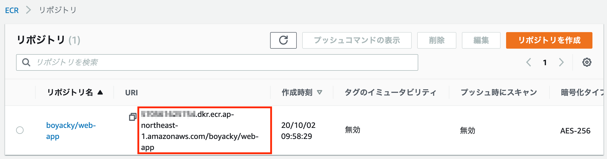

作成したリポジトリ URI は、この後のタスク定義で利用します。コピーして控えてください。

### 4.2 Amazon ECR にDockerイメージを登録
3.2で作成した Docker イメージを ECR に登録します。
Docker クライアントはデフォルトで Docker Hub レジストリのみに対応しているため、ECR へ接続できるように認証トークンを利用して Docker クライアントを認証します。

作成したリポジトリを選択して、[プッシュコマンドの表示]ボタンを押下します。

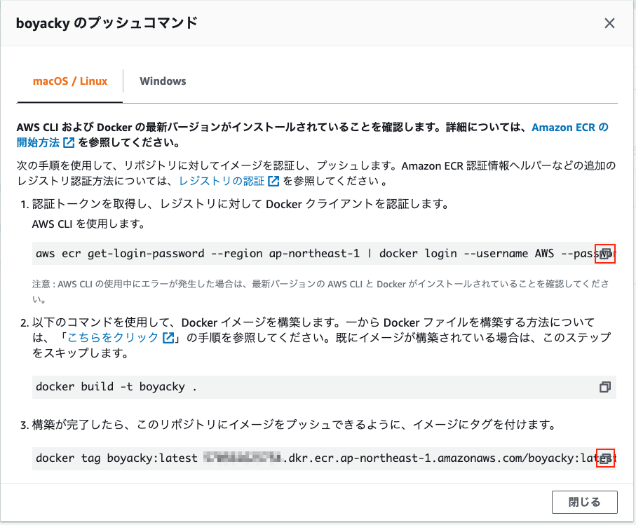

プッシュコマンドの手順を見ながら ECR へプッシュします。

#### 1. 認証トークンを取得してレジストリに対して Docker クライアントを認証

コマンド右側の[コピー]ボタンを押下してクリップボードにコピーして、Cloud9 上のシェルにペーストして実行します。

```
$ aws ecr get-login-password --region ap-northeast-1 | docker login --username AWS --password-stdin xxxxxxxxxxxx.dkr.ecr.ap-northeast-1.amazonaws.com
Login Succeeded
```

コンソールの最後に`Login Succeeded`が表示されれば成功です。WARNING が出た場合は無視してください。

2つのコマンドをパイプ処理で繋げています。

* aws ecr get-login-password
    * AWS CLI コマンドを利用して ECR から認証トークンを取得します。
* docker login
    * --password-stdin で標準入力から認証トークンを受け取ります。

#### 2. Dockerイメージを構築 
既に3.2で Docker イメージを作成したのでスキップします。

* 作成済みのイメージ
    * boyacky/web-app:latest

#### 3. イメージにタグを付け
**【重要】DockerイメージをECRへ登録する場合、クライアント側のイメージ名はECR側のリポジトリURIと一致する必要があります。**


そのため、作成済みのイメージにタグを付けてエイリアスを作成します。

```
$ docker tag boyacky/web-app:latest xxxxxxxxxxxx.dkr.ecr.ap-northeast-1.amazonaws.com/boyacky/web-app
```

> docker tag 元イメージ名[:タグ] 新イメージ名[:タグ]

* 【課題】
    * ターミナルから現在のイメージ一覧を確認してください。
        * タグ付けしたイメージがあることを確認します。
        * `boyacky/web-app:latest`とイメージIDが同じことを確認します。

#### 4. イメージを登録
最後にイメージをECRへ登録します。

```
$ docker push xxxxxxxxxxxx.dkr.ecr.ap-northeast-1.amazonaws.com/boyacky/web-app
```

ECR側のリポジトリURIと一致しない場合、リクエストは拒否されて下記のメッセージが表示されます。

> denied: requested access to the resource is denied

* 【課題】
    * ECRコンソールで登録したイメージがあるか確認してください。


## 5. AWS 上のコンテナ実行環境
Amazon Elastic Container Service（以下、ECS）は、複数の Docker コンテナを管理するオーケストレーションサービスです。

> オーケストレーションは、元々は音楽用語ですが、IT では、システムやソフトウェア、サービスなどの構築、運用管理を自動化することを指します。

AWS では、ECS とは別に Amazon Elastic Kubernetes Service（以下、EKS）も提供されています。

下記の図は AWS が提供するコンテナ関連のサービスです。

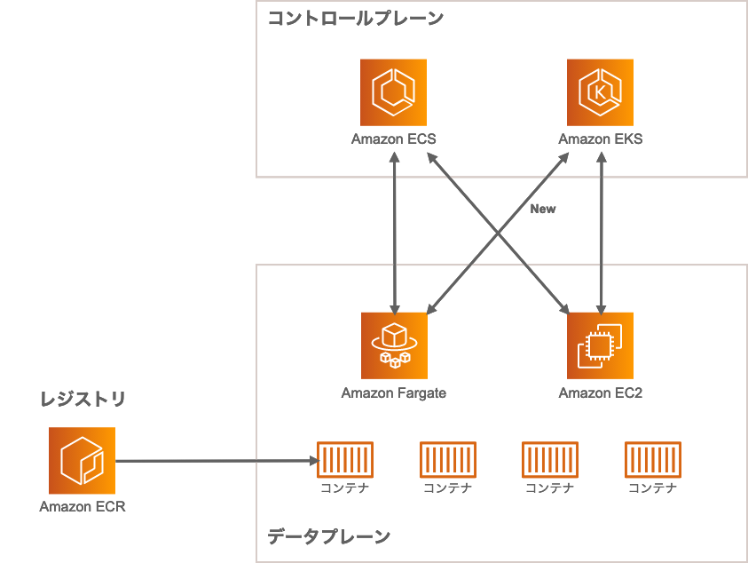

* レジストリ
    * コンテナイメージのレポジトリ
* コントロールプレーン
    * デプロイ、スケジューリング、スケーリング、クラスタ管理
    * ECS または EKS を選択
* データプレーン
    * コンテナの実行環境
    * Fargate または EC2 を選択

### 5.1 コントロールプレーン
コントロールプレーンとして、ECS または EKS を選択できます。

コントロールプレーン比較

| | ECS | EKS |
|----|----|----|
| エンジン | AWS 独自 | Kubernetes (オープンソース) |
| IAM ロール | タスクごとに付与 | 未サポート |
| 監視 | CloudWatch 統合 | なし |
| ログ | CloudWatch Logs 統合 | Fluentd |
| クラスター料金 | 無料 | 0.10 USD/時間 |

AWS 上でコンテナ管理する場合、ECS の方が他の AWS サービスとの連携が豊富です。
EKS は Kubernetes を利用しているため、既存のプラグインやツールを利用可能です。

### 5.2 データプレーン
コンテナの実行環境である、EC2 および Fargate はクラスターで管理され、スケールアウトに対応します。

Fargate を利用した場合、コンテナを実行するための EC2 インスタンスのクラスターをプロビジョニング・設定・スケールする必要はありません。

* Fargate に適さないケース
    * Windows コンテナを利用したい
    * GPU インスタンスを利用したい
    * より大きな CPU やメモリを利用したい
    * 運用コストを最大限抑えたい
    * ホストインスタンスに SSH 接続したい

コントロールプレーンとデータプレーンの組み合わせは4通りあります。
要件により組み合わせを決定しますが、まずは ECS/Fargate を検討してください。
ハンズオンでは ECS/Fargate を利用します。


## 6. ECS クラスターの作成
ECS クラスターを作成する前に、ECSの全体像と構築手順を把握します。

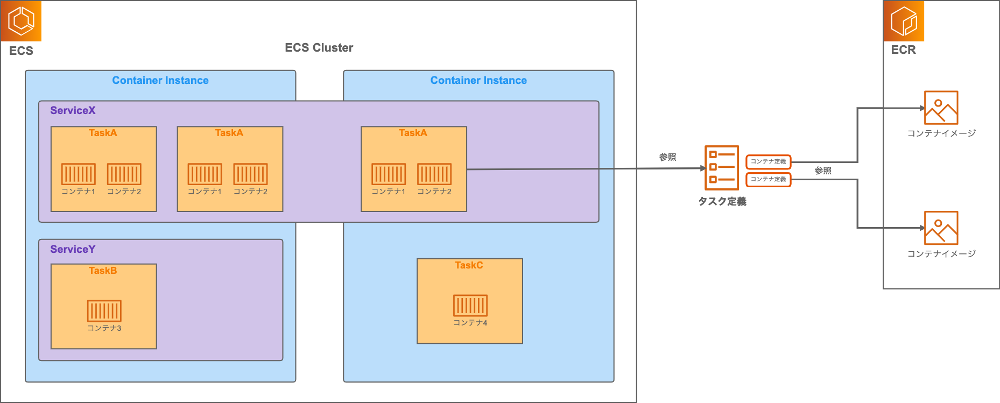

ECSの主要な構成要素

* タスク
    * タスク定義から起動される
    * 同一ホストで1つ以上のコンテナを実行
    * IAMロール、CPU、メモリを割り当て
    * バッチのような1回実行で利用
* サービス
    * タスクを実行してタスクの数を希望数に保つ
    * ALBと連携可能
    * Web アプリケーションのようなサービスで利用
* コンテナインスタンス
    * タスクが実際に起動するコンテナ実行環境としてのEC2インスタンス
    * Fargate の場合は管理不要
* クラスター
    * タスクやサービスを実行する論理的なグループ
    * 1つ以上のコンテナインスタンスで構成

構築手順

1. クラスターの作成
2. タスク定義の作成
    * コンテナ定義の作成 (複数可)
3. サービスの作成


### 6.1 ECS クラスターの作成
Fargate 用のクラスターを作成します。

[ECS コンソール](https://ap-northeast-1.console.aws.amazon.com/ecs)から [クラスター] を選択し、[クラスターの作成] ボタンを押下します。

* ステップ 1: クラスターテンプレートの選択
    * クラスターテンプレートの選択
        * [ネットワーキングのみ]を選択
    * [次のステップ]ボタンを押下
* ステップ 2: クラスターの設定
    * クラスターの設定
        * クラスター名
            * `boyacky-cluster`
    * [作成]ボタンを押下
* [クラスターの表示]ボタンを押下

クラスターの詳細画面が表示されます。ステータスは`ACTIVE`の状態です。

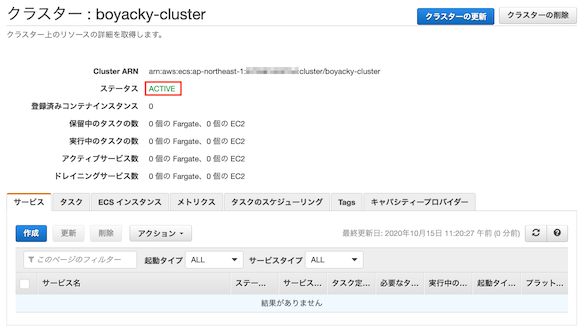

> ハイパーバイザー型仮想化と異なりコンテナはホスト OS のカーネルを共有します。
> 同じクラスターに Linux と Windows を混在させることはできません。

* 【課題】
    * クラスターテンプレートの選択で [EC2 Linux + ネットワーキング] を選択して、[ネットワーキングのみ]の`クラスターの設定`項目の違いを確認してください。
        * 確認のみなので [キャンセル] ボタンを押下します。


## 7. タスク定義の作成
ECS でコンテナを実行するには、タスク定義が必要です。

### 7.1 タスク用のIAMロール作成
タスク定義では2種類のロールを設定します。

* タスクロール
    * タスク側
* タスク実行ロール
    * 

### 7.2 タスク定義の作成
ECSコンソールから[タスク定義]を選択し、[新しいタスク定義の作成]ボタンを押下します。

#### ステップ 1: 起動タイプの互換性の選択
`FARGATE`を選択して [次のステップ] ボタンを押下します。

#### ステップ 2: タスクとコンテナの定義の設定

##### タスクとコンテナの定義の設定
* タスク定義名
    * `boyacky-taskdef`
* タスクロール
    * 7.1で作成したロール
* ネットワークモード
    * `awsvpc`

##### タスクの実行 IAM ロール
* タスク実行ロール
    * `ecsTaskExecutionRole`

`ECS-Agent`がが使用する IAM ロールです。
タスク定義内のコンテナ定義で指定したイメージをプルし、コンテナログを Amazon CloudWatch に転送します。

* 【課題】
    * `ecsTaskExecutionRole`の AWS 管理ポリシーを確認してください。


##### タスクサイズ
    * タスクメモリ (GB)
        * `0.5GB`
    * タスクCPU (vCPU)
        * `0.25 vCPU`
* コンテナの定義
    * [コンテナの追加]ボタンを押下

##### コンテナの追加
[コンテナの追加]用のポップアップウインドウが表示されます。

* スタンダード
    * コンテナ名
        * `boyacky-web-app`
    * イメージ
        * `xxxxxxxxxxxx.dkr.ecr.ap-northeast-1.amazonaws.com/boyacky/web-app`
        * 4.1でコピーしたリポジトリURIをペースト
        * latestタグの場合は省略可能
    * ポートマッピング
        * `8080`

ポップアップウインドウ最下部の[追加]ボタンを押下します。

ポップアップウインドウが閉じて、タスク定義画面のコンテナの定義に追加されます。

画面最下部の[作成]ボタンを押下します。

[タスク定義の表示]ボタンを押下して、タスク定義の詳細画面を表示します。


## 8. サービスの作成

### 8.1 サービスの作成
[アクション]ボタンから[サービスの作成]を選択します。

* ステップ1: サービスの設定
    * 起動タイプ
        * `FARGATE`
    *  サービス名
        * `boyacky-web-service`
    * タスクの数
        * `1`
    * [次のステップ]ボタンを押下
* ステップ2: ネットワーク構成
    * VPC とセキュリティグループ
        * クラスターVPC
            * 1.1で作成したVPCを選択
        * サブネット
            * 1.1で作成したPrivateサブネットを2つ選択
        * セキュリティグループ
            * 1.1で作成した`boyacky_web_sg`
        * パブリック IP の自動割り当て
            * `DISABLED`
    * ロードバランシング
        * ロードバランサーの種類
            * Application Load Balancer
        * ロードバランサー名
            * `boyacky-alb`
    * ロードバランス用のコンテナ
        * コンテナの選択
            * `boyacky-web-app:8080:8080`
        * [ロードバランサーに追加] ボタンを押下 
        * プロダクションリスナーポート
            * 新規作成: `80`
        * プロダクションリスナープロトコル
            * HTTP
        * ターゲットグループ名
            * 新規作成: `ecs-boyack-boyacky-web-service`
        * ターゲットグループのプロトコル
            * HTTP
        * パスパターン
            * `/`
        * ヘルスチェックパス
            * `/`
    * [次のステップ]ボタンを押下
* ステップ3: Auto Scaling (オプション)
    * Service Auto Scaling
        * サービスの必要数を直接調整しない
    * [次のステップ]ボタンを押下
* ステップ4: 確認
    * [サービスの作成]ボタンを押下


## 9. Web アプリケーションの動作確認 (Fargate)
作成したALBへHTTPアクセスしてBoyackyが表示されるか確認してください。

> http:// + ALBのDNS名

* 【課題】
    * ボヤいて一覧に表示されることを確認してください。
    * [浄化]ボタンを押下してボヤキが削除されることを確認してください。


## 10. Web アプリケーションの修正


## 後片付け
ハンズオンで作成したAWSリソースを削除します。

### ECSサービスの削除

### CloudFormationリソースの削除

[CloudFormationコンソール](https://ap-northeast-1.console.aws.amazon.com/cloudformation)を開き、`BoyackyStack`を選択して[削除]ボタンを押下します。
Cloud9用のスタックは、BoyackyStackを削除すると同時に削除されるため、そのままにします。

削除には数分の時間がかかります。

### DynamoDBテーブルの削除
[DynamoDBコンソール](https://ap-northeast-1.console.aws.amazon.com/dynamodb)を開き、`boyacky`テーブルを削除します。
