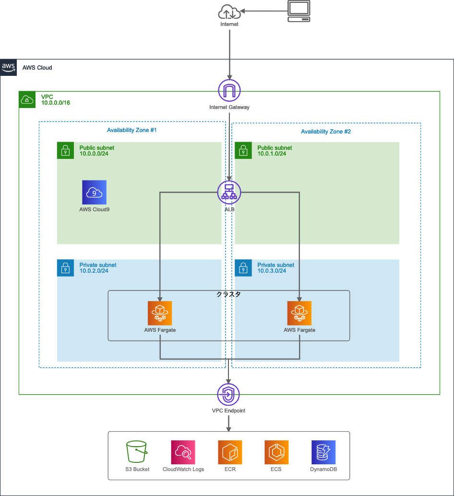

# コンテナを身体で覚える - Day1: ハンズオン

1. 関連リソースの構築
2. Webアプリケーションの動作確認 (Cloud9)
3. Dockerイメージの作成
4. DockerイメージをECRに登録
5. AWS上のコンテナ実行環境
6. ECSクラスターの作成
7. タスク定義の作成
8. サービスの作成
9. Webアプリケーションの動作確認 (Fargate)
10. Webアプリケーションの修正
11. バッチの作成

## はじめに
ハンズオンではAmazon ECS（以下、ECS）を使って、コンテナ用のサーバーレスコンピューティング環境であるAWS Fargate上にWebアプリケーション、`Boyacky`(ボヤッキー) をデプロイします。

以下は全体のシステム構成図です。



BoyackyはSilverworksが作成した、疲れたおじさんをターゲットにしたSNSアプリケーションです。
間もなくサービスインを予定しています。


* 主な機能
   * ボヤく
       * ボヤくと心が一瞬だけ軽くなる
   * 一覧表示
       * 本日のボヤキが表示される (前日以前は表示されない)
       * 見ると心が重くなる
   * 浄化
       * 押すとボヤキが消え、心がすっと軽くなる

> ぼやきというのは、理想と現実とのギャップがあるから生まれるんですよ。  
> ただ、現状を嘆いているだけの愚痴とは違うんです。  
> 人生はままならないものだが、理想へ向けて努力することを忘れてはならない。だからぼやくのです。 
>  
> 野村克也元監督

## 1. 関連リソースの構築
ECSはVPC環境下で利用するサービスです。

ECS上でサービスを動かすためには、多くの関連リソースを構築する必要があります。
インターネットからアクセスするWebアプリケーションの場合、ECS/ECRを構築する前に以下の関連リソースが必要になります。

* VPC
* サブネット
    * PublicとPrivateをそれぞれ2つずつ
* Internet Gateway
* ルートテーブル
    * PublicサブネットのデフォルトルートをIGWに設定
* セキュリティグループ
    * ALB用
    * Webアプリケーション用
* Load Balancer
    * ALB
    * ターゲットグループ
* CloudWatch Log Group
    * コンテナのログ出力先
* IAMロール
* ECS/ECRとの通信
    * NATゲートウェイ or PrivateLink

### 1.1 CloudFormationスタックの作成
今回は時間の都合上、CloudFormation（以下、CF）を利用して関連リソースの構築を自動で行います。構築するAWSリソースは下図になります。


ハンズオンは東京リージョン(ap-northeast-1)で進めますが、別リージョンでも構いません。その場合は適宜読み替えてください。

1. CFテンプレート`boyacky.yaml`のダウンロード
2. [CloudFormationコンソール](https://ap-northeast-1.console.aws.amazon.com/cloudformation)からCFテンプレートファイルのアップロード
    * スタック名: `BoyackyStack`

* 【課題】
    * CFテンプレートの中身を確認してください。
    * スタックが2つ作成されているのを確認してください。
    * 作成されたリソースを確認してください。
        * 後で利用するため、作成した`VPC ID`をメモします。

### 1.2 Cloud9環境の起動
ハンズオンでは作業環境を統一するためCloud9を利用します。
[Cloud9コンソール](https://ap-northeast-1.console.aws.amazon.com/cloud9/home)から`ECS Handson`環境を選択して、[Open IDE]ボタンを押下します。

下図はCloud9を利用してSSH経由でEC2環境に接続するイメージです。


しばらくするとCloud9の画面が表示されます。

* 【課題】
    * Cloud9ではよく使われるCLIがプリインストールされています。ターミナルで下記コマンドを実行してみてください。
        * git --version
        * docker --version
        * aws --version
    * EC2のセキュリティグループ、インバウンドルールを確認してください。
        * Cloud9画面の右上、Youアイコン(丸形)を押下して [Manage EC2 Instance] からEC2コンソール画面を表示できます。


## 2. Webアプリケーションの動作確認 (Cloud9)
まずはCloud9上でBoyackyの動作確認を行い正しく動くことを確認します。  

### 2.1 コードのダウンロード
[ハッサク](https://github.com/hassaku63/boyacky)のGitHubからコードをダウンロードします。

```
$ git clone git@github.com:hassaku63/boyacky.git
```

### 2.2 モジュールのインストール
必要なパッケージをユーザーディレクトリにインストールします。

```
$ cd boyacky
$ pip install --user -r requirements.txt
```

### 2.3 Webアプリケーションのローカル実行
Boyackyを実行します。

```
$ python app.py
 * Serving Flask app "app" (lazy loading)
 * Environment: production
   WARNING: This is a development server. Do not use it in a production deployment.
   Use a production WSGI server instead.
 * Debug mode: off
 * Running on http://0.0.0.0:8080/ (Press CTRL+C to quit)
```

Cloud9ツールバーの [Preview]-[Preview Running Application] を選択して内部ブラウザを表示します。

いくつかデータを登録して動きを確認してください。

> 内部ブラウザのため、Postした後に画面がリフレッシュされません。
> Post後に内部ブラウザ左上のリロードボタンを押してリフレッシュしてください。

Webアプリケーションを終了する場合、ターミナル上で [CTRL]+[C] キーを押します。

* 【課題】
    * app.pyとboyaki.pyのソースコードを開いてロジックを確認してください。
    * templatesフォルダ内のhtmlを開いてレイアウトを確認してください。
    * [DynamoDBコンソール](https://ap-northeast-1.console.aws.amazon.com/dynamodb)で追加したデータを確認してください。


## 3. Dockerイメージの作成
Boyacky用のDockerイメージ（以下、イメージ）を作成します。
作成したイメージをCloud9上でコンテナ実行してDockerコマンドやライフサイクルを確認します。

最初にDockerアーキテクチャを整理します。


Dockerはクライアント・サーバ型のアーキテクチャです。
DockerクライアントはDockerデーモンと通信することで、Dockerコンテナを構築しアプリケーションを実行します。
DockerクライアントとDockerデーモンは同一ホストでも動作しますし、ソケットやRESTful APIを通して別々のホストで動かすことができます。

Cloud9ではDockerクライアントとデーモンがインストールされており、デーモンは自動起動されています。

| コンポーネント | 説明 |
|----|----|
| イメージ | Dockerコンテナを構成するファイルシステムやメタ情報の集合体。<br>イメージはisoファイルのように1ファイルで構成されているわけではなく、親子関係を持つ複数のレイヤーによって構成されています。 |
| コンテナ | イメージを元に作成される仮想環境の実行部分。イメージとコンテナは1:Nの関係です。 |
| レジストリ | イメージをホスティング、バージョン管理、配布するリポジトリ。<br>Dockerレジストリは、Public/Privateに対応した[Docker Hub](https://hub.docker.com)やPrivate用の[Amazon ECR](https://aws.amazon.com/ecr)などがあります。 |

コンポーネント間の関係とライフサイクルも抑えておきます。


Dockerfileは、Docker上で動作させるコンテナの構成情報を記述するためのテキストファイルでイメージの元になります。

* 開発
    1. Dockerfileを作成する
    2. `image build`コマンドでローカルにイメージを作成する
    3. `image push`コマンドでDockerレジストリにイメージを保管する
* 運用
    1. `container run`コマンドでイメージを取得してコンテナを起動する
* 破棄
    1. `container stop`コマンドでコンテナを停止する
    2. `container rm`コマンドでコンテナを削除する

#### Dockerコマンド
コマンドの数が増えたことにより、2017年にDockerコマンドの命令体系が再編成されました。
現在では、サブコマンド(image, container)を利用した新コマンドが推奨されています。

例えば、イメージの一覧表示とコンテナの一覧表示はそれぞれ

* docker images
* docker ps

でしたが、新コマンドでは

* docker image ls
* docker container ls

になります。

イメージ管理用コマンド

| 新コマンド | 旧コマンド | 説明 |
|----|----|----|
| build | | Dockerfile からイメージを構築 |
| history | | イメージの履歴を表示 |
| import | | tar形式のファイルを読み込み、イメージを作成 |
| inspect | | イメージの詳細情報を表示 |
| load | | tar形式または標準入力からイメージを読み込む |
| ls	| images | イメージの一覧表示 |
| prune | - | 使用していないイメージを削除 |
| pull | | イメージをレジストリから取得 |
| push | | イメージをレジストリに送信 |
| rm | rmi | イメージを削除 |
| save | | イメージを tar 形式または標準出力にストリーム |
| tag | | イメージを参照する新しいタグを付ける |

コンテナ管理用コマンド

| 新コマンド | 旧コマンド | 説明 |
|----|----|----|
| attach	| | 実行中のコンテナにアタッチ |
| commit	| | コンテナに対する変更から新しいイメージを作成 |
| cp	| | コンテナとローカル間でファイルとディレクトリのコピー |
| create | | 新しいコンテナの作成 |
| diff | | イメージとコンテナの変更情報を調べる |
| exec | | 実行中のコンテナ内でコマンド実行 |
| export | | コンテナのファイルシステムをtarアーカイブ化 |
| inspect | | コンテナの詳細情報を表示 |
| kill | | コンテナのプロセスを停止(kill) |
| logs | | コンテナのログを表示 |
| ls | ps | コンテナ一覧の表示 |
| pause | | コンテナのプロセスを一時停止(pause) |
| port | | コンテナが使用しているポート情報の表示 |
| prune | - | 停止中の全コンテナを削除 |
| rename | | コンテナの名称を変更 |
| restart | | コンテナを再起動 |
| rm	| | コンテナの削除 |
| run | | 新しいコンテナを実行 |
| start | | 停止中のコンテナを起動 |
| stats | | コンテナのリソース使用状況を表示 |
| stop | | 実行中のコンテナを停止 |
| top | | コンテナが実行しているプロセスを表示 |
| unpause | | 一時停止中のコンテナを再開 |
| update | | コンテナの（リソース）設定を変更 |
| wait | | コンテナが停止するまで待機 |

* 【課題】
    * `service`コマンドでdockerデーモンのステータスを確認してください。
        * sudo service docker status
    * Cloud9のメニュー [Tools]-[Process List] からdockerデーモンを探してみましょう。
    * ターミナルから現在のイメージ一覧を確認してください。
        * 既にイメージがあります。これは何でしょうか？

### 3.1 Dockerfileの作成
Boyacky用のイメージを作成するために、boyackyフォルダ内にDockerfileを作成します。

Cloud9上の左側、Environmentビュー内のboyackyフォルダを右クリック、[New File]を選択します。
ファイル名を`Dockerfile`に変更します。

Dockerfileファイルをダブルクリックしてエディタを開き、下記を貼り付けます。

```
# ファイル内で一行コメントを書けます
FROM python:alpine

WORKDIR /boyacky
COPY . /boyacky

RUN pip install flask==1.1.2
RUN pip install boto3==1.15.8
RUN pip install pynamodb==4.3.3

EXPOSE 8080

ENTRYPOINT ["python3"]
CMD ["-m", "app"]
```

ファイルの保存はエディタ上で [CMD]+[S] キーを押します。

| コマンド | 説明 |
|----|----|
| FROM | ベースのイメージを指定します。 |
| WORKDIR | |
| COPY | |
| RUN | イメージファイル作成時のコマンドを記入 |
| EXPOSE | コンテナ上でListenするポート番号を指定。 |
| ENTRYPOINT | |
| CMD | コンテナ起動時に実行するコマンドを指定 |

ENTRYPOINTはイメージの作成者側でコンテナの用途をある程度制限したい場合に利用します。


Dockerfileの詳しい書き方は、[Dockerfileリファレンス](http://docs.docker.jp/engine/reference/builder.html)を参照してください。

* 【課題】
    * Docker Hubから指定したベースのイメージとタグを検索してください。


### 3.2 イメージの作成
Dockerイメージの作成は`image build`コマンドを利用します。
Dockerfileがあるディレクトリをカレントディレクトリとして下記コマンドを実行します。

```
$ docker image build -t boyacky/web-app .
```

* **docker image build [オプション] Dockerfileのあるパス**
    * オプション
        * -t
            * イメージ名:タグ名を指定
            * イメージ名 (リポジトリ名)
                * 必須
                * 名前空間(/)を付けてリポジトリをカテゴリにグループ化が可能
                    * project/web-app
            * タグ名
                * 省略可能
                * 省略すると`latest`が付与
    * Dockerfileのあるパス
        * 必須
        * カレントディレクトリであれば`.`

> イメージ名:タグ名は省略可能で、その場合はイメージIDで識別します。
> しかし、人が判断する場合は何のイメージか識別しにくいため、必ず付けるようにしましょう。

* 【課題】
    * `image build`コマンドの実行結果ログから何が行われたを確認してください。
    * 現在のイメージ一覧を確認してください。何が追加されたかを確認します。

### 3.3 コンテナの起動
作成したDockerイメージをCloud9上で起動します。
下記のコマンドを実行します。

```
$ docker container run -d -p 8080:8080 boyacky/web-app
```

* **docker container run [オプション] イメージ [コマンド]**
    * オプション
        * -d
            * デタッチモード (コンテナの実行をバックグラウンドで行う)
            * Webアプリケーションは基本デタッチモード
        * -p
            * コンテナのポートをホストに公開 (コンテナ間通信では不要)
            * ホストのポート番号:コンテナのポート番号
    * イメージ
        * イメージ名:タグ名 または イメージID
        * イメージIDは一意であれば途中から省略可能

Cloud9の内部ブラウザでWebアプリケーションのトップページが表示されることを確認をします。

コンテナで起動したWebアプリケーションはAWSへの権限がなくDynamoDBに接続できません。  
Cloud9はデフォルトで、AWS Managed Temporary Credentials (AMTC) が有効になっています。Cloud9起動時にAWSマネジメントコンソールへログインしたユーザーと同等の権限をもつ一時クレデンシャルキーが自動で発行されています。しかしDockerコンテナ内へは引き継ぎされないため、クレデンシャル情報を環境変数から渡すなどの工夫が必要です。


### 3.4 コンテナ内の確認
`container exec`コマンドを使用すると、実行しているコンテナの中で任意のコマンドを実行できます。
実行したコンテナ内のファイル一覧を確認します。

```
$ docker container ls
```

実行中のコンテナIDをメモします。

コンテナIDを指定して、シェルを起動します。

```
$ docker container exec -it {コンテナID} /bin/sh
```

* **docker container exec [オプション] コンテナID コマンド**
    * オプション
        * -it
            * 標準入力を開いたままにして仮想ターミナルを割り当てる
    * コンテナID
    * コマンド

オプション`-it`を付けてシェルを起動すると、あたかもコンテナ内にSSHでログインしたかのようにコンテナ内部を操作可能です。

`ls`コマンドでファイル一覧を確認します。

```
/boyacky # ls -al
```

`exit`コマンドでコンテナ内のシェルを抜けます。

```
/boyacky # exit
```

* 【課題】
    * アプリケーションとは関係ないディレクトリやファイルも含んでいます。何が不要でしょうか？

### 3.5 イメージの再作成
`.dockerignore`ファイルを利用するとイメージ作成時に不要なディレクトリやファイルを除くことができます。

Dockerfileと同じフォルダに.dockerignoreファイルを作成します。

.dockerignore

```
.git
.vscode
Dockerfile
README.md
__pycache__
handson
requirements.txt
```

Dockerイメージを再作成します。

```
$ docker build -t boyacky/web-app .
```

* 【課題】
    * `image ls`コマンドで再作成したイメージと以前のイメージを確認してください。

### 3.6 コンテナの起動
再作成したイメージを以前と同じようにコンテナ実行するとエラーになります。

```
$ docker container run -d -p 8080:8080 -t boyacky/web-app
略
docker: Error response from daemon: driver failed programming external connectivity on endpoint modest_lumiere (略): Bind for 0.0.0.0:8080 failed: port is already allocated.
```

既にホスト側のポート8080を使用しているためエラーになります。ホスト側のポート番号を8081にしてコンテナを実行します。

```
$ docker container run -d -p 8081:8080 -t boyacky/web-app
```

> Cloud9の内部ブラウザでWebアプリケーションを表示する場合、ポート番号 8080, 8081, 8082 のどれかを利用する必要があります。  
> https://docs.aws.amazon.com/ja_jp/cloud9/latest/user-guide/app-preview.html

* 【課題】
    * 新しく実行したコンテナのシェルを起動して不要なファイルがないか確認してください。


## 4. イメージをECRに登録
ECR上にリポジトリを作成して、作成したイメージを登録します。

### 4.1 Amazon ECRにリポジトリを作成
[ECRコンソール](https://ap-northeast-1.console.aws.amazon.com/ecr)から[Repositories]を選択し、[リポジトリを作成]ボタンを押下します。

* リポジトリのアクセスとタグ
    * リポジトリ名
        * `boyacky/web-app`
    * タグのイミュータビリティ
        * 無効

リポジトリ名には名前空間(/)を含めることができます。プロジェクトに複数のリポジトリがある場合などに利用します。

* 例
    * project/web-app
    * project/batch/daily
    * project/batch/monthly

タグのイミュータビリティが無効の場合、タグの上書きが可能です。タグを省略すると`latest`タグが付与されるため、最新イメージのタグは常に`latest`になり、固定タグでの運用が可能です。

タグのイミュータビリティが有効の場合、タグの上書きを禁止できます。
固定タグでの運用は出来なくなるため、新しいイメージがビルドされるたびにタスク定義の変更とサービス定義の変更が必須となります。
しかし、ソースコードとコンテナイメージの一貫性の把握が容易になるというメリットがあります。


画面右下の[リポジトリを作成]ボタンを押下します。


作成したリポジトリURIは、この後のタスク定義で利用します。コピーして控えてください。

### 4.2 Amazon ECR にDockerイメージを登録
3.2で作成したDockerイメージをECRに登録します。
DockerクライアントはデフォルトでDocker Hubレジストリのみに対応しているため、ECRへ接続できるように認証トークンを利用してDockerクライアントを認証します。

作成したリポジトリを選択して、[プッシュコマンドの表示]ボタンを押下します。


プッシュコマンドの手順を見ながらECRへプッシュします。

#### 1. 認証トークンを取得してレジストリに対して Dockerクライアントを認証

コマンド右側の[コピー]ボタンを押下してクリップボードにコピーして、Cloud9上のシェルにペーストして実行します。

```
$ aws ecr get-login-password --region ap-northeast-1 | docker login --username AWS --password-stdin xxxxxxxxxxxx.dkr.ecr.ap-northeast-1.amazonaws.com
Login Succeeded
```

コンソールの最後に`Login Succeeded`が表示されれば成功です。WARNINGが出た場合は無視してください。

2つのコマンドをパイプ処理で繋げています。

* aws ecr get-login-password
    * AWS CLIコマンドを利用してECRから認証トークンを取得します。
* docker login
    * --password-stdin で標準入力から認証トークンを受け取ります。

#### 2. Dockerイメージを構築 
既に3.2でDockerイメージを作成したのでスキップします。

* 作成済みのイメージ
    * boyacky/web-app:latest

#### 3. イメージにタグを付け
**【重要】DockerイメージをECRへ登録する場合、クライアント側のイメージ名はECR側のリポジトリURIと一致する必要があります。**


そのため、作成済みのイメージにタグを付けてエイリアスを作成します。

```
$ docker tag boyacky/web-app:latest xxxxxxxxxxxx.dkr.ecr.ap-northeast-1.amazonaws.com/boyacky/web-app
```

> docker tag 元イメージ名[:タグ] 新イメージ名[:タグ]

* 【課題】
    * ターミナルから現在のイメージ一覧を確認してください。
        * タグ付けしたイメージがあることを確認します。
        * `boyacky/web-app:latest`とイメージIDが同じことを確認します。

#### 4. イメージを登録
最後にイメージをECRへ登録します。

```
$ docker push xxxxxxxxxxxx.dkr.ecr.ap-northeast-1.amazonaws.com/boyacky/web-app
```

ECR側のリポジトリURIと一致しない場合、リクエストは拒否されて下記のメッセージが表示されます。

> denied: requested access to the resource is denied

* 【課題】
    * ECRコンソールで登録したイメージがあるか確認してください。


## 5. AWS上のコンテナ実行環境
Amazon Elastic Container Service (以下、ECS) は、複数のDockerコンテナを管理するオーケストレーションサービスです。

> オーケストレーションは、元々は音楽用語ですが、ITでは、システムやソフトウェア、サービスなどの構築、運用管理を自動化することを指します。

AWSでは、ECSとは別にAmazon Elastic Container Service for Kubenetes (以下、EKS)も提供されています。

下記の図はAWSが提供するコンテナ関連のサービスです。


* レジストリ
    * コンテナイメージのレポジトリ
* コントロールプレーン
    * デプロイ、スケジューリング、メンテナンス等のコンテナアプリケーション管理
    * ECSまたはEKSを選択
* データプレーン
    * コンテナの実行環境
    * FargateまたはEC2を選択

### 5.1 コントロールプレーン
コントロールプレーンとして、ECSまたはEKSを選択できます。

コントロールプレーン比較

| | ECS | EKS |
|----|----|----|
| エンジン | AWS独自 | Kubernetes (オープンソース) |
| IAMロール | タスクごとに付与 | 未サポート |
| 監視 | CloudWatch統合 | なし |
| ログ | CloudWatch Logs統合 | Fluentd |
| クラスター料金 | 無料 | 0.10USD/時間 |

AWS上でコンテナ管理する場合、ECSの方が他のAWSサービスとの連携が豊富です。EKSはKubernetesを利用しているため、既存のプラグインやツールを利用可能です。

### 5.2 データプレーン
コンテナの実行環境である、EC2およびFargateはクラスターで管理され、スケールアウトに対応します。

Fargateを利用した場合、コンテナを実行するためのEC2インスタンスのクラスターをプロビジョニング・設定・スケールする必要はありません。

* Fargateに適さないケース
    * Windowsコンテナを利用したい
    * GPUインスタンスを利用したい
    * より大きなCPUやメモリを利用したい
    * 運用コストを最大限抑えたい
    * ホストインスタンスにSSH接続したい

コントロールプレーンとデータプレーンの組み合わせは4通りあります。
要件により組み合わせを決定しますが、まずはECSとFargateを検討してください。
ハンズオンでもECSとFargateを利用します。


## 6. ECSクラスターの作成
ECSクラスターを作成する前に、図を見ながら用語と構築手順を抑えます。


* 

* クラスター
* コンテナインスタンス


| 用語 | 説明 |
|----|----|
| サービス | |
| タスク | |
| コンテナ | |

構築手順

1. クラスターの作成
2. タスク定義の作成
    * コンテナ定義の作成
3. サービスの作成


### 6.3 ECSクラスターの作成
Fargate用のクラスターを作成します。

[ECSコンソール](https://ap-northeast-1.console.aws.amazon.com/ecs)から[クラスター]を選択し、[クラスターの作成]ボタンを押下します。

* ステップ 1: クラスターテンプレートの選択
    * クラスターテンプレートの選択
        * [ネットワーキングのみ]を選択
    * [次のステップ]ボタンを押下
* ステップ 2: クラスターの設定
    * クラスターの設定
        * クラスター名
            * boyacky-cluster
    * [作成]ボタンを押下
* [クラスターの表示]ボタンを押下

クラスターの詳細画面が表示されます。ステータスは`ACTIVE`の状態です。


* 【課題】
    * クラスターテンプレートの選択で [EC2 Linux + ネットワーキング] を選択して、[ネットワーキングのみ]の`クラスターの設定`項目の違いを確認してください。
        * 確認のみなので [キャンセル] ボタンを押下します。


## 7. タスク定義の作成

### 7.1 タスク用のIAMロール作成


### 7.2 タスク定義の作成
ECSコンソールから[タスク定義]を選択し、[新しいタスク定義の作成]ボタンを押下します。

#### 起動タイプの互換性の選択
`FARGATE`を選択して[次のステップ]ボタンを押下します。

#### タスクとコンテナの定義の設定

* タスク定義名
    * `boyacky-taskdef`
* タスクロール
    * 6.1で作成したロール
* タスクの実行IAMロール
    * タスク実行ロール
        * `新しいロールの作成`
* タスクサイズ
    * タスクメモリ (GB)
        * `0.5GB`
    * タスクCPU (vCPU)
        * `0.25 vCPU`
* コンテナの定義
    * [コンテナの追加]ボタンを押下

##### コンテナの追加
[コンテナの追加]用のポップアップウインドウが表示されます。

* スタンダード
    * コンテナ名
        * `boyacky-web-app`
    * イメージ
        * `xxxxxxxxxxxx.dkr.ecr.ap-northeast-1.amazonaws.com/boyacky/web-app`
        * 4.1でコピーしたリポジトリURIをペースト
        * latestタグの場合は省略可能
    * ポートマッピング
        * `8080`

ポップアップウインドウ最下部の[追加]ボタンを押下します。

ポップアップウインドウが閉じて、タスク定義画面のコンテナの定義に追加されます。

画面最下部の[作成]ボタンを押下します。

[タスク定義の表示]ボタンを押下して、タスク定義の詳細画面を表示します。


## 8. サービスの作成

### 8.1 サービスの作成
[アクション]ボタンから[サービスの作成]を選択します。

* ステップ1: サービスの設定
    * 起動タイプ
        * `FARGATE`
    *  サービス名
        * `boyacky-web-service`
    * タスクの数
        * `1`
    * [次のステップ]ボタンを押下
* ステップ2: ネットワーク構成
    * VPC とセキュリティグループ
        * クラスターVPC
            * 1.1で作成したVPCを選択
        * サブネット
            * 1.1で作成したPrivateサブネットを2つ選択
        * セキュリティグループ
            * 1.1で作成した`boyacky_web_sg`
        * パブリック IP の自動割り当て
            * `DISABLED`
    * ロードバランシング
        * ロードバランサーの種類
            * Application Load Balancer
        * ロードバランサー名
            * `boyacky-alb`
    * ロードバランス用のコンテナ
        * コンテナの選択
            * `boyacky-web-app:8080:8080`
        * [ロードバランサーに追加] ボタンを押下 
        * プロダクションリスナーポート
            * 新規作成: `80`
        * プロダクションリスナープロトコル
            * HTTP
        * ターゲットグループ名
            * 新規作成: `ecs-boyack-boyacky-web-service`
        * ターゲットグループのプロトコル
            * HTTP
        * パスパターン
            * `/`
        * ヘルスチェックパス
            * `/`
    * [次のステップ]ボタンを押下
* ステップ3: Auto Scaling (オプション)
    * Service Auto Scaling
        * サービスの必要数を直接調整しない
    * [次のステップ]ボタンを押下
* ステップ4: 確認
    * [サービスの作成]ボタンを押下


## 9. Webアプリケーションの動作確認 (Fargate)
作成したALBへHTTPアクセスしてBoyackyが表示されるか確認してください。

> http:// + ALBのDNS名

* 【課題】
    * ボヤいて一覧に表示されることを確認してください。
    * [浄化]ボタンを押下してボヤキが削除されることを確認してください。


## 10. Webアプリケーションの修正


## 11. バッチの作成


## 後片付け
ハンズオンで作成したAWSリソースを削除します。

### ECSサービスの削除

### CloudFormationリソースの削除

[CloudFormationコンソール](https://ap-northeast-1.console.aws.amazon.com/cloudformation)を開き、`BoyackyStack`を選択して[削除]ボタンを押下します。
Cloud9用のスタックは、BoyackyStackを削除すると同時に削除されるため、そのままにします。

削除には数分の時間がかかります。

### DynamoDBテーブルの削除
[DynamoDBコンソール](https://ap-northeast-1.console.aws.amazon.com/dynamodb)を開き、`boyacky`テーブルを削除します。
